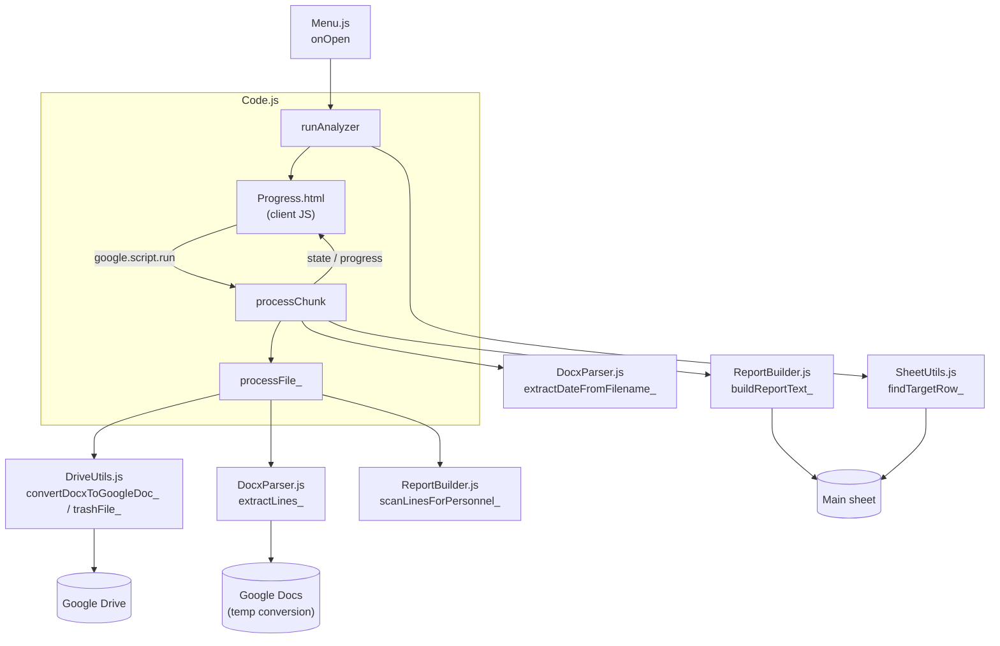

# Journal Analyzer

A Google Apps Script (clasp-managed) project bound to a Google Sheet. It automates reading daily `.docx` personnel-status reports out of a Google Drive folder and writing an attendance summary back into the sheet.

## Setup

1. `clasp login` (once per machine).
2. `clasp push` to deploy the local `.js`/`.json` files to the live Apps Script project (script ID in `.clasp.json`).
3. `clasp open` to open the Apps Script editor — useful to confirm the Drive Advanced Service is enabled with no error, or to read execution logs.
4. Reload the bound spreadsheet to pick up the "Journal Analyzer" custom menu.

## Sheet contract

The bound spreadsheet must have a sheet named `Main`. Each row is one analysis job:

- **B** — a Google Drive folder link or bare folder ID
- **C** — output; empty until processed

Every row's `.docx` files are scanned for position-header lines using the single regex hardcoded as `POSITION_HEADER_REGEX` in `Config.js` — there's no per-row regex anymore.

Running "Journal Analyzer → Run analysis" processes exactly **one** row per invocation: the first row (top to bottom) with non-empty B and empty C. Multiple rows require multiple menu invocations.

Each `.docx` filename must contain a date (`DD.MM.YYYY`, `DD.MM.YY`, `DD_MM_YYYY`, or `DD-MM-YYYY`) identifying the day it reports on. The output written to C is one line per person, in order of first appearance across the processed files:

```
с-нт ІВАНОВ А.В. — 4 — 01.06.2026; 03.06.2026-05.06.2026
```

## Architecture

Apps Script concatenates every `.js` file in the project into one global scope — file boundaries here are purely organizational, not module boundaries. `Menu.js` installs the custom menu, which calls `runAnalyzer` in `Code.js`. It asks `SheetUtils.js` for the next eligible row, then opens the `Progress.html` dialog, which drives the actual folder processing in time-boxed chunks (avoiding Apps Script's 6-minute execution limit on large folders): client-side JS in the dialog repeatedly calls `processChunk` via `google.script.run`, and each call processes as many files as fit in a ~4-minute budget before returning progress and a resumable state for the next call. For each `.docx` file, `processChunk` uses `DriveUtils.js` to convert it to a temporary Google Doc and `DocxParser.js` to pull out its text lines, and `ReportBuilder.js` scans those lines for personnel entries. Once every file in the folder has been processed, `ReportBuilder.js` builds the final report text, which is written back to the sheet.



See `CLAUDE.md` for implementation-level detail on the parsing state machine, identity/date-tracking rules, and other non-obvious invariants.
