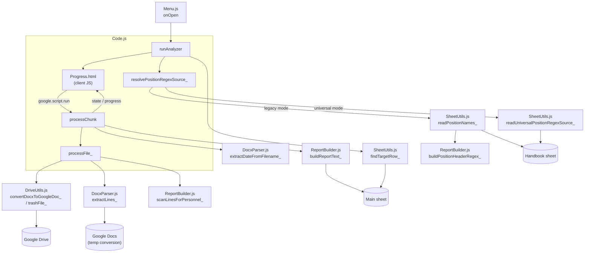

# Journal Analyzer

A Google Apps Script (clasp-managed) project bound to a Google Sheet. It automates reading daily `.docx` personnel-status reports out of a Google Drive folder and writing an attendance summary back into the sheet.

## Setup

1. `clasp login` (once per machine).
2. `clasp push` to deploy the local `.js`/`.json` files to the live Apps Script project (script ID in `.clasp.json`).
3. `clasp open` to open the Apps Script editor — useful to confirm the Drive Advanced Service is enabled with no error, or to read execution logs.
4. Reload the bound spreadsheet to pick up the "Journal Analyzer" custom menu.

For a new bound spreadsheet, import [`samples/Journal Analyzer.xlsx`](samples/Journal%20Analyzer.xlsx) (File → Import → Insert new sheet(s), in Google Sheets) to get a pre-built `Main`/`Handbook` sheet layout to start from, rather than creating both sheets by hand.

The script requests the broad `.../auth/drive` OAuth scope (not just `drive.file`), since it must read arbitrary pre-existing Drive folders rather than only files it created itself. `appsscript.json` leaves `oauthScopes` unset so Apps Script auto-detects this from code.

## Sheet contract

The bound spreadsheet must have a sheet named `Main`. Each row is one analysis job (see [`samples/Journal Analyzer.xlsx`](samples/Journal%20Analyzer.xlsx) for a filled-in example of both sheets):

- **B** — a Google Drive folder link or bare folder ID
- **C** — `170` or `70`, picked from a dropdown (configured manually in the Sheets UI) selecting which Handbook position-name list applies to this row
- **D** — output; empty until processed

It must also have a sheet named `Handbook` with two lists of position names: column **A** for list `170`, column **B** for list `70`. Each row's `.docx` files are scanned for position-header lines using a regex built once per run from whichever Handbook list column C selects — there is no single global position-header regex anymore.

`Handbook!D1` is a checkbox that globally overrides the name-list lookup above: when checked, every run instead matches position headers using the regex typed verbatim into `Handbook!C2`, and `Main!C`'s `170`/`70` value is ignored entirely. Leave it unchecked for the default per-row behavior described above.

Running "Journal Analyzer → Run analysis" processes exactly **one** row per invocation: the first row (top to bottom) with non-empty B and empty D — plus, when the `Handbook!D1` override is off, a valid (non-empty, recognized) C. Multiple rows require multiple menu invocations.

Each `.docx` filename must contain a date (`DD.MM.YYYY`, `DD.MM.YY`, `DD_MM_YYYY`, or `DD-MM-YYYY`) identifying the day it reports on. The output written to D is one line per person, in order of first appearance across the processed files:

```
с-нт ІВАНОВ А.В. — 4 — 01.06.2026; 03.06.2026-05.06.2026
```

## Architecture

Apps Script concatenates every `.js` file in the project into one global scope — file boundaries here are purely organizational, not module boundaries. `Menu.js` installs the custom menu, which calls `runAnalyzer` in `Code.js`. It asks `SheetUtils.js` for the next eligible row, then resolves that row's header-matching regex via `Code.js`'s `resolvePositionRegexSource_`: normally this reads the row's Handbook position-name list (`SheetUtils.js`'s `readPositionNames_`) and builds a regex via `ReportBuilder.js`'s `buildPositionHeaderRegex_`, but when `Handbook!D1` is checked, it instead reads the regex directly from `Handbook!C2` (`SheetUtils.js`'s `readUniversalPositionRegexSource_`). Either way, `runAnalyzer` then opens the `Progress.html` dialog, which drives the actual folder processing in time-boxed chunks (avoiding Apps Script's 6-minute execution limit on large folders): client-side JS in the dialog repeatedly calls `processChunk` via `google.script.run`, and each call processes as many files as fit in a budget before returning progress and a resumable state for the next call. For each `.docx` file, `processChunk` uses `DriveUtils.js` to convert it to a temporary Google Doc and `DocxParser.js` to pull out its text lines, and `ReportBuilder.js` scans those lines for personnel entries against that run's header regex. Once every file in the folder has been processed, `ReportBuilder.js` builds the final report text, which is written back to the sheet.


```mermaid
graph TD
  Menu["Menu.js\nonOpen"] --> runAnalyzer

  subgraph Code["Code.js"]
    runAnalyzer
    processChunk
    processFile_
    resolvePositionRegexSource_
    runAnalyzer --> Dialog
    runAnalyzer --> resolvePositionRegexSource_
    processChunk --> processFile_
  end

  Dialog["Progress.html\n(client JS)"] -- "google.script.run" --> processChunk
  processChunk -- "state / progress" --> Dialog

  runAnalyzer --> SheetUtils["SheetUtils.js\nfindTargetRow_"]
  resolvePositionRegexSource_ -- "legacy mode" --> SheetUtils2["SheetUtils.js\nreadPositionNames_"]
  resolvePositionRegexSource_ -- "universal mode" --> SheetUtils3["SheetUtils.js\nreadUniversalPositionRegexSource_"]
  SheetUtils2 --> ReportBuilder0["ReportBuilder.js\nbuildPositionHeaderRegex_"]
  processChunk --> DocxParser1["DocxParser.js\nextractDateFromFilename_"]
  processFile_ --> DriveUtils["DriveUtils.js\nconvertDocxToGoogleDoc_ / trashFile_"]
  processFile_ --> DocxParser2["DocxParser.js\nextractLines_"]
  processFile_ --> ReportBuilder1["ReportBuilder.js\nscanLinesForPersonnel_"]
  processChunk --> ReportBuilder2["ReportBuilder.js\nbuildReportText_"]

  DriveUtils --> Drive[("Google Drive")]
  DocxParser2 --> Docs[("Google Docs\n(temp conversion)")]
  SheetUtils --> Sheet[("Main sheet")]
  SheetUtils3 --> Handbook[("Handbook sheet")]
  SheetUtils2 --> Handbook
  ReportBuilder2 --> Sheet
```

See `CLAUDE.md` for implementation-level detail on the parsing state machine, identity/date-tracking rules, and other non-obvious invariants.
